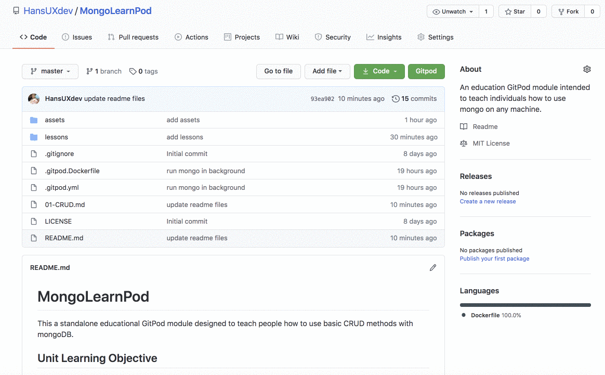
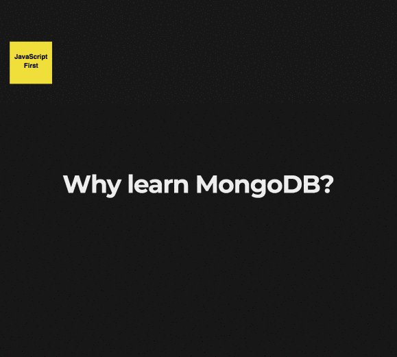

# MongoLearnPod
This a standalone educational GitPod module designed to teach people how to use basic CRUD methods with mongoDB.

## Unit Learning Objective
Students should be to:
1. Teach Basic CRUD methods with MongoDB & GitPod
2. Use Docker Compose to start and stop mongoDB environment
3. Use Docker, Terminal & MongoExpress to teach basic mongoDB concepts
4. Distinguish between the name of a docker image (mongo) and the container name (learn-mongo)
5. Use NPM Scripts to store docker commands
   

# Read and Code Along!
Assuming you are logged into github, then just click the button below. Phone, Tablet, Mac, Windows, Linux, Chromebook, as long as GitPod runs, you can learn how to code, anywhere!

  
     

Once GitPod has started up, just type `mongo` into the terminal and it should look something like the gif below. 

Unfortunately, the fancy slideshow extension I just for this lesson doesn't work in gitpod... yet (stay tuned).

In the meantime, I recorded a [short video](https://recordit.co/ns0fuHZheI) of the lesson. 

You can also view the slide on vscode with [vscode-reveal](https://marketplace.visualstudio.com/items?itemName=evilz.vscode-reveal). If you have the extension installed you can follow long with the fancy [slideshow](./01-CRUD.md). Lastly, you can just read it in readme formate and it'll just look slightly less presentable...

Last but not least, I will be streaming lessons on [my twitch channel](https://www.twitch.tv/hansoncoding/about) so consider joining the lesson live.

# What did you build
Today we'll be learning how to use Docker Compose to learn MongoDB.

## Unit Learning Objective
Students should be to:
1. Use GitPod to startup a mongoDB environment.
2. Use docker exec to access the mongoDB Shell 
3. Distinguish between the name of a docker image (mongo) and the container name (learn-mongo)
4. Use NPM Scripts to store docker commands such as docker exec for mongo shell

## Using Mongo Shell to build a database
Type the following into a NEW terminal: ` mongo`. 
  

 
# Conclusion
If you like it this repo and want to see more on this topic, give it a star. 

If there is enough interest in it, I'll add it too the final draft of  [JavaScript-First](https://github.com/HansUXdev/JavaScript-First) which is an open source book that teaches people how to code with JavaScript using the node.js runtime environment rather than a browser and by the end, you will build a server and a website using JavaScript.

   

<!-- ## Key learnings -->

## Tips and advice

   
1. [w3-Resource](https://www.w3resource.com/mongodb/databases-documents-collections.php#:~:text=A%20collection%20is%20analogous%20to,are%20not%20same%20in%20structure.&text=In%20a%20relational%20database%20like,formula%20defining%20structure%20of%20data)
   
2. Try the [freecodecamp lesson](https://www.freecodecamp.org/news/learn-mongodb-a4ce205e7739/)

<!-- ## Final thoughts and next steps
   
1. Try this out with the local docker version. -->

