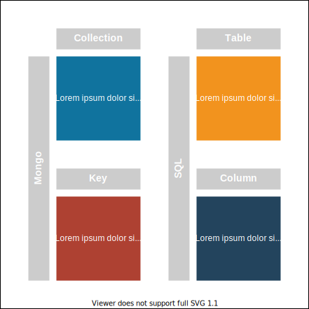
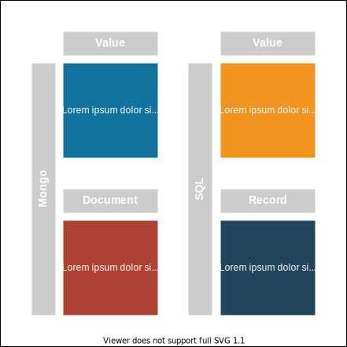

<style>
#logo > img {max-height: 10.5em;}
.p1{padding:1em; border:none}
</style>

### Why learn MongoDB?
* JavaScript Syntax based off JSON { .fragment }
* Simple to learn { .fragment }

--

### What is JSON?
* Stands for, JavaScript Object Notation
* Curly braces, `{}` hold objects
* Square brackets, `[]` hold arrays
* Data is in name/value pairs
* keys must be strings, written with double quotes:
  ```JSON
  { "name":"John" }
  ```
* Data is separated by commas
  ```JSON
  { "name":"John" },
  { "name":"Jane" }
  ```


--

### Mongo VS SQL

:::block
[]() { .fragment .p1}

{style=width:50%;float:left; height:50%}

:::

:::block
Collections VS Tables { .fragment }

Key VS Column { .fragment }

  
{style=width:50%;float:right}

:::

--

### Mongo VS SQL

:::block
[]() 

{style=width:50%;float:left; height:50%}

:::

:::block
Document VS Record { .fragment }

Key: values 
:::


--

### Mongo Datatypes
Values have a datatype


---

### What is C.R.U.D.?

[]()
{ .fragment .p1}


---

## Exercise 1: Oh CRUD...


--

### Oh CRUD... Methods

:::block
  ```javascript
  use stateBar

  db
  .stateBar
  .insert(
    {
      name: 'Hans', row:1, os:'Mac', 
      hobbies:['Hardware Design', '3D Prototyping'] 
    }
  )
  db.stateBar
  .find({row:1})

  db.stateBar
  .update({name: "Hans"}, 
  {$push: {"hobbies":"Teaching"}})

  db.stateBar.insert({name: 'Doug', row:2, os:'linux', hobbies:['Crime'] })

  db.stateBar.remove({name:"Doug"})
  ```
  {style=width:80%;float:left}
:::

:::block

Select the mongo database {.fragment .current-only data-code-focus=1-1}

calls the selected **database** {.fragment .current-only data-code-focus=3-3}

calls the selected **collection** {.fragment .current-only data-code-focus=4-4}

**CREATES** the data by inserting the `{}` into our collection {.fragment .current-only data-code-focus=5-10}

call the database and the collection {.fragment .current-only data-code-focus=11-11}

**READS** the data in our collection and find the everyone in row 1 {.fragment .current-only data-code-focus=12-12}

**UPDATES** the data by pushing a new hobby, to "Hans" {.fragment .current-only data-code-focus=15-16}

add another lawyer from the state bar, "Doug" {.fragment .current-only data-code-focus=18-18}

**DELETES** a disbar the lawyer "Doug" {.fragment .current-only data-code-focus=20-20}

  
{style=width:20%;float:right}

:::


