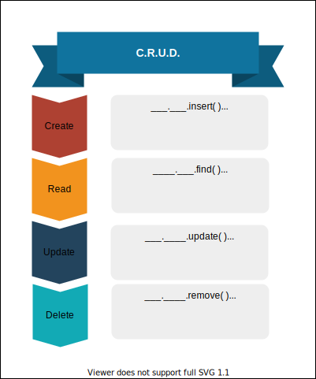

---
# This readme file is best viewed as a slideshow powever by [vscode-reveal](https://github.com/evilz/vscode-reveal)
# Doesn't work well in GitPod yet ... https://github.com/evilz/vscode-reveal/issues/527
title: "Introduction to Mongo"
# The logo can be swapped out with Free Code Camp
logoImg: "https://raw.githubusercontent.com/HansUXdev/JavaScript-First/2acf5840c15af96602aceb66303ea69c5b75e344/logo.svg"
theme : "night"
transition: "slide"
highlightTheme: "dracula"
slideNumber: true
# loop: true
# autoSlide: 5000 
# openButton: false
enableMenu: false
# controlsLayout: 'edges'
# controls: true
enableChalkboard: false
# enableTitleFooter: false
---

<link rel="stylesheet" href="../theme.css">


### Why learn MongoDB?

<div class="flex-slide">

:::block
[]() 

{.column}
:::

:::block
JavaScript-like Syntax
* Simple to learn 

<!-- * Collections VS Tables { .fragment }

* Key VS Column { .fragment } -->

{.double-column .fragment}
:::

</div>

<!-- https://www.mongodb.com/json-and-bson -->


---

### What is JSON?
* Stands for, JavaScript Object Notation
* Curly braces, `{}` hold objects
* Square brackets, `[]` hold arrays
* Data is in name/value pairs
* keys must be strings, written with double quotes:
  ```JSON
  { "name":"John" }
  ```
* Data is separated by commas
  ```JSON
  { "name":"John" },
  { "name":"Jane" }
  ```

---


### [BSON](https://www.mongodb.com/json-and-bson) is Binary JSON 


Has more datatypes than javascript  {.fragment .current-only data-code-focus=1-1 }


---


### What is C.R.U.D.?


:::block
[]() 

{style=width:50%;float:left; height:50%}

:::

:::block
**C**reate with `insert( )` { .fragment }

**R**ead with `find( )` { .fragment }

**U**pdate with `update( )` { .fragment }

**D**elete with `remove( )`  { .fragment }

{style=width:50%;float:right; height:50%}
:::

---


### Comparing CREATE Methods
#### Query Syntax: SQL


<div class="flex-slide">

:::block
<!-- []() { .fragment .p1} -->

```sql
INSERT INTO book('title', 'author')
VALUES('JavaScript First', '@HansOnConsult');
```

{.column}
:::

:::block
  Step:1 INSERT INTO speficies the table `book` will be added  {.fragment .current-only data-code-focus=1-1} 

  The `( )` set the **something**  {.fragment .current-only data-code-focus=1-1}

  `VALUES()` stores the information in columns  {.fragment .current-only data-code-focus=2-2}


{.double-column}
:::

</div>


---

### Comparing CREATE Methods
#### Query Syntax: Mongo


<div class="flex-slide">

:::block
<!-- []() { .fragment .p1} -->

```javascript
db.book.insert(
  {
    title:"JavaScript First",
    author:"HansOnConsult"
  }
);
```

{.column}
:::

:::block
<!-- understand -->
 
 `db` refers to the current database {.fragment .current-only data-code-focus=1-1}

 `book` refers to the collection  {.fragment .current-only data-code-focus=1-1}

Start `{}`   {.fragment .current-only data-code-focus=2-2}

Ends `{}`   {.fragment .current-only data-code-focus=5-5}
<!-- Help them: understand -->
`title` refers to the **key**  {.fragment .current-only data-code-focus=3-3 }
<!-- Help them: understand -->
the text inside  `" "` refers to the **value**  {.fragment .current-only data-code-focus=3-4 }


{.double-column}
:::

</div>

---

## Exercise 1: Oh CRUD...

To get started just click the gitpod button after signing into github, then type `mongo` into the shell..

--

### Oh CRUD... Methods

:::block
  ```javascript
  use stateBar

  db
  .stateBar
  .insert(
    {
      name: 'Hans', row:1, os:'Mac', 
      hobbies:['Hardware Design', '3D Prototyping'] 
    }
  )
  db.stateBar
  .find({row:1})

  db.stateBar
  .update({name: "Hans"}, 
  {$push: {"hobbies":"Teaching"}})

  db.stateBar.insert({name: 'Doug', row:2, os:'linux', hobbies:['Crime'] })

  db.stateBar.remove({name:"Doug"})
  ```
  {style=width:80%;float:left}
:::

:::block

Select the mongo database {.fragment .current-only data-code-focus=1-1}

calls the selected **database** {.fragment .current-only data-code-focus=3-3}

calls the selected **collection** {.fragment .current-only data-code-focus=4-4}

**CREATES** the data by inserting the `{}` into our collection {.fragment .current-only data-code-focus=5-10}

call the database and the collection {.fragment .current-only data-code-focus=11-11}

**READS** the data in our collection and find the everyone in row 1 {.fragment .current-only data-code-focus=12-12}

**UPDATES** the data by pushing a new hobby, to "Hans" {.fragment .current-only data-code-focus=15-16}

add another lawyer from the state bar, "Doug" {.fragment .current-only data-code-focus=18-18}

**DELETE** the lawyer "Doug" {.fragment .current-only data-code-focus=20-20}

  
{style=width:20%;float:right}

:::


